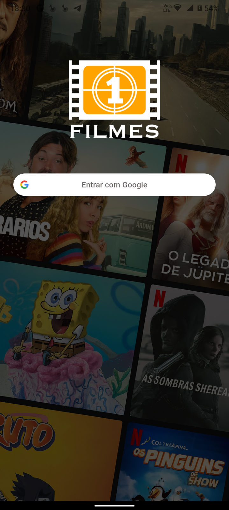

# cinebox

PROJETO  CINEBOX FLUTTER EXPIRIENCE AGOSTO 2025

## Inicio

Este projeto foi criado durante a participação do evento flutter expirience, evento este onde é ministrado por Rodrigo Rhaman um GDE. Considerado o maior eventdo de flutter do brasil.

## Qual o objetivo do app?

O app tem como objetivo criar app de filmes, com criticas, descrições, e a possiblidade de favoritar os filmes. O app vai usar uma API  pública com backend próprio, usando arquiteturaa recomendada pela Google. 

## Detalhes técnicos

 Criação de um aplicativo completo utilizando Flutter. 
 Aplicação da arquitetura oficial recomendada pela Google. 
 Gerenciamento de estado e injeção de dependências com Riverpod. 
 Integração com APIs REST utilizando Retrofit
 Implementação de autenticação com Google Sign-In. 
 Consumo de dados da API do The Movie Database (TMDb). 
 Integração com backend próprio para controle de favoritos. 
 Boas práticas de estruturação e organização de projetos Flutter

 ## Pacotes utilizados 
 <ul>
  <li>flutter_riverpod: ^3.0.0-dev.17</li>
  <li>riverpod_annotation: ^3.0.0-dev.17</li>
  <li>envied: ^1.2.0</li>
  <li>retrofit: ^4.7.1</li>
  <li>logger: ^2.6.1</li>
  <li>json_annotation: ^4.9.0</li>
  <li>dev: ^1.0.0</li>
  <li>json_serializable: ^6.10.0</li>
  <li>retrofit_generator: ^10.0.0</li>
  <li>dio: ^5.9.0</li>
  <li>loading_animation_widget: ^1.3.0</li>
  <li>flutter_secure_storage: ^9.2.4</li>
  <li>google_sign_in: ^7.1.1</li>
  <li>cached_network_image: ^3.4.1</li>
  <li>flutter_rating_stars: ^1.1.0</li>
  <li>youtube_player_flutter: ^9.1.2</li>
</ul>

## Telas do sistema

 ## Certificação emitida na finalização do evento

     

